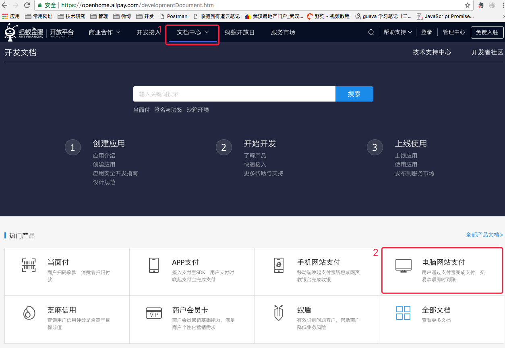

# 阿里网页支付接入

   适用于电商类网站接入支付宝支付功能
   
接入主要步骤

## 1. 找到支付宝网页支付接入入口

&nbsp;&nbsp;&nbsp;&nbsp;&nbsp;访问[支付宝开放平台](https://open.alipay.com/)
    
&nbsp;&nbsp;&nbsp;&nbsp;&nbsp;

## 2. 快速了解支付宝文档主要结构

    快速浏览一遍整个文档.

&nbsp;&nbsp;&nbsp;&nbsp;&nbsp;[产品介绍](https://docs.open.alipay.com/270/105898/)

&nbsp;&nbsp;&nbsp;&nbsp;&nbsp;[快速接入](https://docs.open.alipay.com/270/105899/)

&nbsp;&nbsp;&nbsp;&nbsp;&nbsp;[支付结果异步通知](https://docs.open.alipay.com/270/105902/)

&nbsp;&nbsp;&nbsp;&nbsp;&nbsp;[SDK&Demo](https://docs.open.alipay.com/270/106291/)

&nbsp;&nbsp;&nbsp;&nbsp;&nbsp;[API列表](https://docs.open.alipay.com/270/105900/)

&nbsp;&nbsp;&nbsp;&nbsp;&nbsp;[联调问题排查](https://docs.open.alipay.com/common/fr9vsk)

## 3. 了解支付宝整个流程

    主要分为以下几个部分: 
    1. 商户发起支付
    2. 用户扫码或登录支付 
    3. 同步回调商户网站 (对应图中步骤 #6)
    4. 异步支付成功通知 (对应图中步骤 #7)
    5. 主动查询交易结果 (对应图中步骤 #8)
    6. 交易其他处理(退款, 关闭等) 

&nbsp;&nbsp;&nbsp;&nbsp;&nbsp;

## 4. 准备接入

    支付宝提供了专门的SDK,为后续开发接入带来便利, 我们需要提前准备好以下几个重要参数:  
        
        AlipayClient alipayClient = new DefaultAlipayClient(URL,APP_ID,APP_PRIVATE_KEY,FORMAT,CHARSET,ALIPAY_PUBLIC_KEY,SIGN_TYPE);
        
        URL: 支付宝支付网关地址
        APP_ID: 应用ID
        APP_PRIVATE_KEY: 支付应用私钥
        ALIPAY_PUBLIC_KEY: 支付宝公钥

    如何获取? 按照文档步骤, 我们得到支付宝开放平台创建应用,并进行后续设置. 但是作为前期开发,支付宝提供一个沙箱环境, 我们可以先不着急申请正式的应用ID和密钥.

### 4.1. 沙箱环境入口  

&nbsp;&nbsp;&nbsp;&nbsp;&nbsp;每个支付宝账户都拥有一个沙箱环境, 你可以[登录支付宝开放平台](https://auth.alipay.com/login/ant_sso_index.htm?goto=https%3A%2F%2Fopenhome.alipay.com%2Fplatform%2FappDaily.htm)
  
&nbsp;&nbsp;&nbsp;&nbsp;&nbsp;

&nbsp;&nbsp;&nbsp;&nbsp;&nbsp;或者

&nbsp;&nbsp;&nbsp;&nbsp;&nbsp;

### 4.2. 沙箱环境配置
  
    阿里采用的非对称加密算法RSA
  
    这里需要为沙箱应用(后续就是为我们创建的商户应用)设置公钥, 用于支付宝开放平台与商户应用通信时加密. 
      
    同理, 支付宝会提供一个公钥给我们, 用于商户应用与开放平台通信是加密.
  
&nbsp;&nbsp;&nbsp;&nbsp;&nbsp;

    设置好后如下图:

&nbsp;&nbsp;&nbsp;&nbsp;&nbsp;